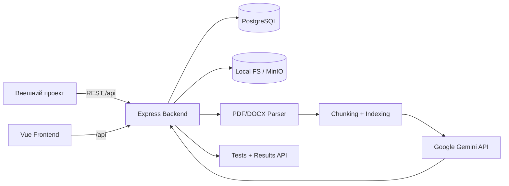
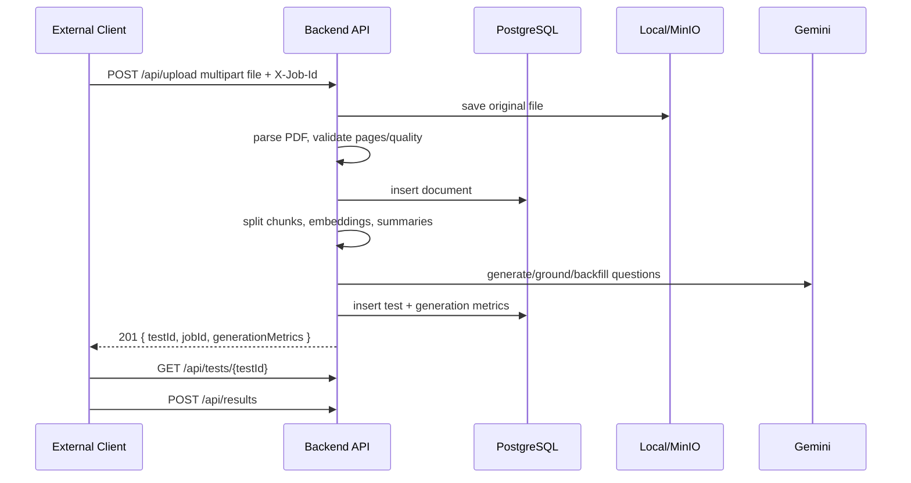

# AI Test Generator: Integration Guide

Документ описывает, как подключить AI Test Generator к внешней системе через REST API. Актуально для текущего кода проекта: backend на Node.js/Express, БД PostgreSQL, frontend на Vue/Vite, файловое хранилище local или MinIO, AI pipeline на Google Gemini.

## 1. Назначение проекта

AI Test Generator принимает учебный документ, извлекает текст, режет его на чанки, строит индекс, генерирует вопросы через LLM и сохраняет тесты/результаты прохождения.

| Задача | Что делает система |
|---|---|
| Генерация тестов | Создает вопросы из PDF-документа с вариантами ответа, true/false и открытыми форматами, если они возвращены генератором |
| RAG и grounding | Индексирует чанки документа, подбирает релевантный контекст и проверяет привязку вопросов к источнику |
| Прохождение тестов | Отдает тест внешнему UI и сохраняет ответы пользователя |
| Аналитика | Возвращает результаты, проценты, детализацию ответов и обзор по пользователю |
| Администрирование AI | Управляет моделями, правилами маршрутизации, режимами генерации, аудитом и run-observability |

Основные модули:

| Модуль | Технологии | Роль |
|---|---|---|
| Frontend | Vue 3, Vite, fetch API | UI загрузки, прохождения тестов, результатов и AI-админки |
| Backend | Node.js, Express | REST API, auth, upload, orchestration pipeline |
| Database | PostgreSQL | Документы, чанки, embeddings, тесты, результаты, пользователи, AI routing и audit |
| Storage | Local FS или MinIO | Хранение исходных файлов и метаданных |
| AI/RAG | Google Gemini, embeddings, chunker, indexer | Генерация и проверка вопросов |

> Важно: парсер содержит поддержку PDF и DOCX, но текущий публичный `POST /api/upload` разрешает только MIME `application/pdf`. Для внешней интеграции считайте поддерживаемым входным форматом PDF, пока whitelist загрузки не расширен.

## 2. Архитектура



Основной pipeline:



## 3. Интеграция: быстрый сценарий

Базовый URL:

| Среда | URL |
|---|---|
| Docker/nginx | `http://<host>/api` |
| Backend напрямую | `http://<host>:3002/api` |
| Frontend dev proxy | `/api` через Vite на `http://localhost:3002` |

Минимальный сценарий:

1. Проверить сервис: `GET /api/health`.
2. Получить модели и режимы: `GET /api/models`, `GET /api/generation-modes`.
3. Создать `jobId` на клиенте.
4. Загрузить PDF: `POST /api/upload` с multipart-полем `file` и заголовком `X-Job-Id`.
5. Пока идет загрузка/генерация, опрашивать `GET /api/jobs/{jobId}`.
6. После `201` взять `testId`.
7. Получить тест: `GET /api/tests/{testId}` или экспорт: `GET /api/tests/{testId}/export`.
8. Передать ответы пользователя: `POST /api/results`.
9. Получить итог: `GET /api/results/detail/{resultId}` или обзор: `GET /api/results/overview?userName=...`.

## 4. Авторизация и пользователи

JWT нужен для пользовательского профиля и админских операций. Генерация, получение тестов и сохранение результатов сейчас публичные.

| Операция | Auth |
|---|---|
| Регистрация/логин | Не требуется |
| `GET /api/auth/me`, смена пароля | `Authorization: Bearer <jwt>` |
| `DELETE /api/tests/:id` | JWT пользователя с ролью `admin` |
| `/api/admin/ai/*` | JWT пользователя с ролью `admin` |
| `/api/logs` | `X-Logs-Token`, если задан `LOGS_API_TOKEN` |
| `/_hidden/settings/*` | `X-Settings-Token`, если задан `SETTINGS_API_TOKEN` |

Передача пользователей из внешней системы возможна двумя способами:

| Вариант | Когда использовать | Как работает |
|---|---|---|
| Простая интеграция | Не нужен единый SSO | Внешняя система передает отображаемое имя в `POST /api/results.userName` |
| Аккаунты AI Test Generator | Нужен профиль/админка | Создать пользователя через `/api/auth/register`, хранить JWT у клиента |

Текущие результаты привязаны к `userName`; таблицы также имеют `user_id`, но публичный submit endpoint не принимает его напрямую.

## 5. REST API / Swagger-контракты

Все ответы ошибок имеют JSON-форму:

```json
{
  "error": "Краткое описание",
  "details": "Технические детали, если доступны"
}
```

### Системные endpoint'ы

| Method | Path | Auth | Query/Body | 2xx response | Ошибки |
|---|---|---|---|---|---|
| GET | `/api/health` | no | - | Статус БД, storage, API key, upload limits, quota | Всегда `200`, `status=degraded` при проблемах БД |
| GET | `/api/models` | no | - | `{ models, defaultModel, quotaTier, embeddingModel }` | `500` |
| GET | `/api/agents` | no | - | `{ agents: [{ id, label }] }` | `500` |
| GET | `/api/generation-routing` | no | `mode=auto|economy|balanced|quality|max_quality|manual|customCode` | Public snapshot роутинга | `500` |
| GET | `/api/generation-modes` | no | - | `{ ok, modes }` | `500` |
| GET | `/api/jobs/:jobId` | no | `jobId` `[A-Za-z0-9_-]{1,80}` | `{ ok, phase, stage, percent, history }` | `400`, `404` |
| GET | `/api/logs` | token optional | `limit=1..500`, `token` optional | `{ logs }` | `403` |
| GET | `/api/_hidden/settings/runtime` | settings token optional | - | `{ success, settings }` | `403` |
| POST | `/api/_hidden/settings/gemini-key` | settings token optional | `{ geminiApiKey }` | `{ success, settings }` | `400`, `403` |

### Документы и тесты

| Method | Path | Auth | Request | Response | Ошибки |
|---|---|---|---|---|---|
| POST | `/api/upload` | no | `multipart/form-data`, file field `file`; headers `X-Job-Id`; fields `model`, `routingMode`, `complexityScore`, `forceOffline`, `jobId` | `201 { success, jobId, testId, title, totalQuestions, generationMetrics, documentInfo }` | `400`, `413`, `415`, `402`, `422`, `429`, `502` |
| GET | `/api/tests` | no | - | `{ tests }` | `500` |
| GET | `/api/tests/:id` | no | `id` | Test detail with `questions` | `404` |
| GET | `/api/tests/:id/export` | no | `id` | `ai_test_export.v1` JSON | `404` |
| DELETE | `/api/tests/:id` | admin JWT | `id` | `{ success: true }` | `401`, `403`, `404` |

### Результаты

| Method | Path | Auth | Request | Response | Ошибки |
|---|---|---|---|---|---|
| POST | `/api/results` | no | `{ testId, userName, answers }` | `201 { resultId, score, maxScore, percentage, answers }` | `400`, `404`, `422` |
| GET | `/api/results/overview` | no | `userName?` | `{ averagePercentage, completedCount, totalTests, items }` | `500` |
| GET | `/api/results/detail/:id` | no | `id` | Result detail with `answers` and `questions` | `404` |
| GET | `/api/results/:testId` | no | `testId` | `{ results }` | `500` |

### Auth

| Method | Path | Auth | Request | Response | Ошибки |
|---|---|---|---|---|---|
| POST | `/api/auth/register` | no | `{ email, password, fullName }` | `201 { message, token, user }` | `400`, `409` |
| POST | `/api/auth/login` | no | `{ email, password }` | `{ message, token, user }` | `400`, `401` |
| GET | `/api/auth/me` | JWT | - | `{ user }` | `401` |
| POST | `/api/auth/change-password` | JWT | `{ currentPassword, newPassword }` | `{ message }` | `400`, `401` |

### Admin AI

Все endpoint'ы ниже требуют `Authorization: Bearer <adminJwt>` и префикс `/api/admin/ai`.

| Method | Path | Назначение |
|---|---|---|
| GET | `/models` | Реестр AI-моделей |
| POST | `/models/sync` | Синхронизация моделей Gemini |
| PATCH | `/models/:id` | Обновление UI/meta/enable/preview модели |
| GET | `/routing-matrix` | Матрица выбора моделей по стадиям |
| POST | `/routing-rules/bulk-patch` | Массовое обновление правил |
| GET | `/routing-rules/:phase` | Правила по фазе |
| POST | `/routing-rules` | Создание routing rule |
| PATCH | `/routing-rules/:id` | Обновление routing rule |
| PATCH | `/routing-rules/:id/enabled` | Включить/выключить rule |
| GET | `/usage` | Сырые записи использования моделей |
| GET, PUT | `/routing-mode` | Глобальный режим маршрутизации |
| GET, POST | `/manual-overrides` | Ручные override модели |
| PATCH | `/manual-overrides/:id` | Изменить override |
| GET | `/audit` | Audit log админских действий |
| GET | `/stages`, `/stages/:stageKey` | Каталог стадий pipeline |
| GET, PATCH | `/global-policies` | Глобальные политики роутинга |
| GET | `/routing-decisions` | Explainability-журнал решений |
| GET | `/routing-decisions/:id` | Одно routing decision |
| GET | `/routing-decisions/:id/explain` | Человекочитаемое объяснение решения |
| GET | `/model-health`, `/model-health/:modelId` | Health моделей |
| GET | `/routing-rules-by-stage/:stageKey` | Правила по stage key |
| GET | `/routing-profiles` | Профили тарифов/роутинга |
| PUT | `/routing-profiles/:code/rules/:stage_name` | Изменить правило профиля |
| POST | `/router/resolve` | Dry resolve модели для профиля/стадии |
| GET | `/runs`, `/runs/:id` | Запуски генерации и timeline |
| GET | `/usage-overview` | Агрегированная статистика использования |
| GET, POST | `/modes` | Список/создание кастомных режимов |
| GET, PUT | `/modes/:id` | Получение/обновление режима |
| POST | `/modes/:id/disabled` | Включить/выключить режим |
| POST | `/modes/:id/clone` | Клонировать режим |
| POST | `/modes/:id/archive` | Архивировать/разархивировать |
| POST | `/modes/:id/validate` | Проверить конфигурацию режима |
| POST | `/modes/:id/dry-run` | Предпросмотр эффективного плана |
| POST | `/modes/:id/test-run` | Тестовый запуск режима |
| GET | `/modes/:id/runs` | Запуски конкретного режима |
| GET | `/modes/:id/export` | Экспорт `ai_mode_profile.v1` |
| POST | `/modes/import` | Импорт режима |

### Типовые коды ошибок

| Код | Причина | Что делать интегратору |
|---|---|---|
| `400` | Неверные поля, пустой файл, некорректный id | Исправить request body/query |
| `401` | Нет JWT или он недействителен | Повторить login/register |
| `403` | Недостаточно прав, CORS, неверный service token | Проверить роль/admin token/CORS |
| `404` | Тест, result или job не найден | Проверить id, TTL job progress |
| `413` | Файл слишком большой или превышен лимит страниц | Уменьшить PDF или поднять лимиты |
| `415` | Неподдерживаемый формат | Загружать PDF |
| `422` | Ошибка парсинга документа или поврежден тест | Проверить текстовый слой PDF |
| `402` | Нужен offline fallback consent | Повторить upload с `forceOffline=true`, если UI это поддерживает |
| `429` | Rate limit, quota или budget guard | Повторить позже, сменить модель/режим |
| `502` | Ошибка LLM | Повторить, сменить модель, проверить Gemini API key |
| `500` | Внутренняя ошибка | Смотреть `/api/logs` и backend logs |

## 6. Примеры curl

### Health

```bash
curl http://localhost:3002/api/health
```

### Регистрация и логин

```bash
curl -X POST http://localhost:3002/api/auth/register \
  -H "Content-Type: application/json" \
  -d '{"email":"dev@example.com","password":"secret123","fullName":"Dev User"}'
```

```bash
curl -X POST http://localhost:3002/api/auth/login \
  -H "Content-Type: application/json" \
  -d '{"email":"dev@example.com","password":"secret123"}'
```

### Загрузка PDF и запуск генерации

```bash
JOB_ID="job-$(date +%s)"

curl -X POST "http://localhost:3002/api/upload?jobId=${JOB_ID}" \
  -H "X-Job-Id: ${JOB_ID}" \
  -F "file=@./lesson.pdf" \
  -F "routingMode=balanced" \
  -F "model=gemini-2.5-flash-lite"
```

Пример ответа:

```json
{
  "success": true,
  "jobId": "job-1711536000",
  "testId": 42,
  "title": "Тест по документу: lesson.pdf",
  "totalQuestions": 20,
  "generationMetrics": {
    "final_question_count": 20,
    "final_quality_score": 0.82,
    "retrieval_hit_rate": 0.91
  },
  "documentInfo": {
    "id": 10,
    "name": "lesson.pdf",
    "pages": 12,
    "textLength": 45000,
    "extractionQuality": 0.95,
    "lowTextQuality": false,
    "parseMethod": "pdf-parse"
  }
}
```

### Опрос прогресса

```bash
curl "http://localhost:3002/api/jobs/${JOB_ID}"
```

```json
{
  "ok": true,
  "jobId": "job-1711536000",
  "phase": "generate",
  "stage": "llm_batch",
  "percent": 62,
  "detail": "Генерация вопросов: пакет 2/5",
  "workDone": 48,
  "workTotal": 77,
  "volumeReady": true,
  "history": []
}
```

### Получение теста

```bash
curl http://localhost:3002/api/tests/42
```

```json
{
  "id": 42,
  "title": "Тест по документу: lesson.pdf",
  "questions": [
    {
      "id": 1,
      "type": "multiple_choice",
      "question": "Что описывает документ?",
      "options": ["A", "B", "C", "D"],
      "correct_answer": 2,
      "explanation": "Ответ следует из раздела 1."
    }
  ],
  "totalQuestions": 1,
  "documentName": "lesson.pdf",
  "pageCount": 12,
  "generationMetrics": null
}
```

### Сохранение результата

```bash
curl -X POST http://localhost:3002/api/results \
  -H "Content-Type: application/json" \
  -d '{
    "testId": 42,
    "userName": "Ivan Petrov",
    "answers": [
      { "questionId": 1, "answer": 2 },
      { "questionId": 2, "answer": true }
    ]
  }'
```

```json
{
  "resultId": 77,
  "score": 1,
  "maxScore": 2,
  "percentage": 50,
  "answers": [
    {
      "questionId": 1,
      "userAnswer": 2,
      "correctAnswer": 2,
      "isCorrect": true,
      "explanation": "..."
    }
  ]
}
```

## 7. Пример интеграции во внешнем проекте

```js
const API_BASE = 'https://ai-tests.example.com/api';

export async function generateTestFromPdf(file, { routingMode = 'balanced' } = {}) {
  const jobId = crypto.randomUUID();
  const form = new FormData();
  form.append('file', file);
  form.append('routingMode', routingMode);
  form.append('jobId', jobId);

  const response = await fetch(`${API_BASE}/upload?jobId=${encodeURIComponent(jobId)}`, {
    method: 'POST',
    headers: { 'X-Job-Id': jobId },
    body: form
  });

  const payload = await response.json();
  if (!response.ok) {
    throw new Error(payload.details || payload.error || 'Upload failed');
  }
  return payload;
}

export async function loadTest(testId) {
  const response = await fetch(`${API_BASE}/tests/${testId}`);
  if (!response.ok) throw new Error('Test not found');
  return response.json();
}

export async function submitTestResult(testId, userName, answers) {
  const response = await fetch(`${API_BASE}/results`, {
    method: 'POST',
    headers: { 'Content-Type': 'application/json' },
    body: JSON.stringify({ testId, userName, answers })
  });
  const payload = await response.json();
  if (!response.ok) throw new Error(payload.error || 'Submit failed');
  return payload;
}
```

Отображение теста во внешнем UI:

| Question type | Как отправлять ответ |
|---|---|
| `multiple_choice` | Индекс выбранного варианта: `{ questionId: 1, answer: 2 }` |
| `true_false` | Boolean: `{ questionId: 2, answer: true }` |
| open/string | Строка до 2000 символов: `{ questionId: 3, answer: "..." }` |

Сервер сейчас автоматически начисляет баллы только для `multiple_choice` и `true_false`.

## 8. Основной функционал

| Функция | Реализация |
|---|---|
| Загрузка файла | `multer`, поле `file`, временная запись в `UPLOAD_DIR`, затем local/MinIO storage |
| PDF parsing | Текстовый слой через PDF parser, fallback/OCR при `ENABLE_PDF_OCR=true` и наличии GraphicsMagick/Ghostscript |
| DOCX parsing | Есть в parser через `mammoth`, но upload whitelist не пропускает DOCX |
| Chunking | `CHUNK_TOKEN_LIMIT`, `CHUNK_OVERLAP_TOKENS`, сохранение в `chunks` |
| Indexing | Embeddings, summaries, extractive facts, RAG retrieval |
| Generation | Gemini model, routing mode, grounding, dedup, backfill |
| Modes | `auto`, `economy`, `balanced`, `quality`, `max_quality`, `manual`, плюс кастомные mode profiles |
| Results | `results.answers_json`, score, max_score, percentage, completed_at |
| Admin panel | `/admin/ai/*`: модели, правила, тарифы, runs, usage, policies, custom modes |

## 9. База данных и хранилище

Ключевые таблицы PostgreSQL:

| Таблица | Назначение |
|---|---|
| `documents` | Метаданные документа, качество парсинга, storage key |
| `chunks` | Текстовые фрагменты документа |
| `chunk_embeddings` | Embedding-векторы по чанкам |
| `chunk_summaries` | Summary/extractive facts |
| `tests` | Сгенерированный тест и `questions_json` |
| `results` | Ответы и оценка прохождения |
| `users` | Аккаунты и роли `user/admin` |
| `gemini_usage`, `ai_model_usage` | Квоты и usage |
| `generation_runs`, `pipeline_events` | Observability pipeline |
| `ai_*`, `custom_mode_*` | AI registry, routing, policies, audit, mode profiles |

Миграции применяются автоматически при старте backend из `backend/db/migrations/*.sql`.

Хранилище:

| Backend | Переменные | Особенности |
|---|---|---|
| `local` | `STORAGE_BACKEND=local`, `DATA_DIR` | Файлы в `${DATA_DIR}/uploads` или `backend/uploads` |
| `minio` | `STORAGE_BACKEND=minio`, `MINIO_ENDPOINT`, `MINIO_PORT`, `MINIO_ACCESS_KEY`, `MINIO_SECRET_KEY`, `MINIO_BUCKET` | MinIO не входит в текущий compose, подключается как внешний сервис |

## 10. Запуск для разработчика

### Локально

Требования: Node.js 18+, PostgreSQL, Gemini API key. Для OCR PDF нужны GraphicsMagick и Ghostscript.

1. Создать `.env` в корне:

```env
GEMINI_API_KEY=your-key
PORT=3002
PGHOST=localhost
PGPORT=5432
PGDATABASE=ai_testgen
PGUSER=ai_testgen
PGPASSWORD=your-pg-password
JWT_SECRET=your-random-secret-at-least-32-characters-long
MAX_FILE_SIZE_MB=10
STORAGE_BACKEND=local
```

2. Запустить backend:

```bash
cd backend
npm install
npm run dev
```

3. Запустить frontend:

```bash
cd frontend
npm install
npm run dev
```

4. Проверить:

```bash
curl http://localhost:3002/api/health
```

### Docker Compose

```bash
cp .env.example .env
# заполнить GEMINI_API_KEY и POSTGRES_PASSWORD
docker compose up -d --build
```

Состав compose:

| Service | Роль | Порт |
|---|---|---|
| `nginx` | Reverse proxy | `${HOST_PORT:-80}:80` |
| `app` | Node backend + собранный frontend | `${APP_HOST_PORT:-3002}:3002` |
| `postgres` | PostgreSQL 16 | `${POSTGRES_HOST_PORT:-5433}:5432` |

В Compose пользователь БД для app фиксирован как `ai_testgen`, пароль берется из `POSTGRES_PASSWORD`.

## 11. Env-переменные

| Переменная | Обязательно | Описание |
|---|---:|---|
| `GEMINI_API_KEY` | yes | Ключ Google Gemini; можно обновлять через hidden settings endpoint |
| `LLM_MODEL` | no | Модель по умолчанию |
| `EMBEDDING_MODEL` | no | Модель embeddings |
| `PORT` | no | Порт backend, default `3002` |
| `JWT_SECRET` | prod yes | Секрет JWT, минимум 32 символа |
| `DATABASE_URL` | no | Полная строка подключения PostgreSQL |
| `PGHOST`, `PGPORT`, `PGDATABASE`, `PGUSER`, `PGPASSWORD` | yes, если нет `DATABASE_URL` | PostgreSQL config |
| `POSTGRES_PASSWORD` | Docker yes | Пароль Postgres в compose |
| `MAX_FILE_SIZE_MB` | no | Лимит файла, default `10` |
| `CHUNK_TOKEN_LIMIT`, `CHUNK_OVERLAP_TOKENS` | no | Chunking |
| `STORAGE_BACKEND` | no | `local` или `minio` |
| `MINIO_*` | если MinIO | Подключение к объектному хранилищу |
| `ENABLE_PDF_OCR`, `MAX_OCR_PAGES` | no | OCR fallback для PDF |
| `CORS_ORIGINS` | prod recommended | Список origin через запятую |
| `LOGS_API_TOKEN`, `SETTINGS_API_TOKEN` | recommended | Защита debug/settings endpoint'ов |
| `API_RATE_LIMIT_*`, `UPLOAD_RATE_LIMIT_*` | no | Rate limits |
| `SUMMARY_MODE` | no | `extractive`, `llm`, `cheap_llm`, `none` |
| `LOCAL_GEMINI_QUOTA_ENABLED` | no | Локальная блокировка по quota |

Frontend:

| Переменная | Описание |
|---|---|
| `VITE_API_BASE` | Base API, default `/api` |
| `VITE_BACKEND_ORIGIN` | Dev proxy target |
| `VITE_LOGS_API_TOKEN` | Токен логов для UI |
| `VITE_SETTINGS_API_TOKEN` | Токен runtime settings для UI |

## 12. OpenAPI структура

Рекомендуется добавить в проект `docs/openapi.yaml` и сгенерировать Swagger UI на `/api/docs` или в отдельной статике. Минимальный каркас:

```yaml
openapi: 3.0.3
info:
  title: AI Test Generator API
  version: 1.0.0
servers:
  - url: /api
components:
  securitySchemes:
    bearerAuth:
      type: http
      scheme: bearer
      bearerFormat: JWT
    logsToken:
      type: apiKey
      in: header
      name: X-Logs-Token
    settingsToken:
      type: apiKey
      in: header
      name: X-Settings-Token
  schemas:
    Error:
      type: object
      properties:
        error: { type: string }
        details: { type: string }
    UploadResponse:
      type: object
      properties:
        success: { type: boolean }
        jobId: { type: string }
        testId: { type: integer }
        title: { type: string }
        totalQuestions: { type: integer }
        generationMetrics: { type: object, nullable: true }
        documentInfo: { type: object }
paths:
  /health:
    get:
      summary: Health check
      responses:
        '200':
          description: Service status
  /upload:
    post:
      summary: Upload PDF and generate test
      parameters:
        - in: header
          name: X-Job-Id
          schema: { type: string }
      requestBody:
        required: true
        content:
          multipart/form-data:
            schema:
              type: object
              required: [file]
              properties:
                file:
                  type: string
                  format: binary
                model:
                  type: string
                routingMode:
                  type: string
                forceOffline:
                  type: boolean
      responses:
        '201':
          description: Generated test
          content:
            application/json:
              schema:
                $ref: '#/components/schemas/UploadResponse'
        '415':
          description: Unsupported file type
```

В OpenAPI стоит полностью описать схемы `Test`, `Question`, `Result`, `JobProgress`, `AuthUser`, `AdminModel`, `RoutingRule`, `ModeProfile`.

## 13. Рекомендации по улучшению для внешней интеграции

| Приоритет | Что улучшить | Зачем |
|---|---|---|
| High | Добавить реальный `docs/openapi.yaml` и Swagger UI | Внешние команды смогут генерировать клиентов и видеть точные схемы |
| High | Решить контракт по DOCX: либо разрешить MIME в upload, либо убрать DOCX из публичных описаний | Сейчас parser поддерживает DOCX, upload публично принимает только PDF |
| High | Сделать асинхронную генерацию: `POST /documents`, `POST /tests/generate`, `GET /jobs/:id` | Сейчас `POST /upload` держит долгий HTTP-запрос до завершения генерации |
| High | Привязать результаты к `user_id` или внешнему `externalUserId` | `userName` недостаточен для надежной интеграции с внешней системой |
| Medium | Стандартизировать casing ответов: snake_case или camelCase | Сейчас список тестов частично snake_case, детали частично camelCase |
| Medium | Добавить pagination/filter к `/api/tests` и `/api/results/:testId` | Нужно для больших внешних каталогов |
| Medium | Добавить webhook/callback после генерации | Внешнему проекту не придется polling job |
| Medium | Вынести upload limits и supported formats в отдельный endpoint/schema | Сейчас это есть в `/health`, но лучше отдельный machine-readable contract |
| Medium | Защитить публичные write endpoint'ы API key/JWT режимом для production | `POST /api/upload` и `POST /api/results` публичны |
| Low | Синхронизировать README/docs со статусом PostgreSQL | В старых местах встречаются упоминания SQLite |

