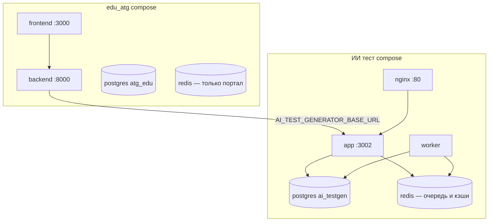

# Деплой AI Test Generator + edu_atg (оптимальный путь)

Руководство для production/staging: один хост, Docker Compose, поэтапное включение оптимизаций **без потери качества**.

---

## Архитектура (рекомендуемая)



**Важно:** у AI-сервиса и edu_atg **разные** PostgreSQL. Redis у edu_atg и Redis у AI — **разные инстансы** (так проще и безопаснее).

---

## Предварительные требования

| Компонент | Версия |
|-----------|--------|
| Docker Engine + Compose v2 | актуальная |
| RAM на хосте | ≥ 4 GB (OCR + LLM) |
| `GEMINI_API_KEY` | Google AI Studio |
| Сеть | общая Docker-сеть между `backend` (edu_atg) и `ai-testgen-app` |

---

## Шаг 1. Подготовка файлов

### 1.1 AI Test Generator (`ИИ тест/`)

```bash
cd "ИИ тест"
cp docs/env.example .env
# Отредактируйте .env: GEMINI_API_KEY, POSTGRES_PASSWORD
```

Обязательно в `.env`:

```env
ENABLE_GROUNDING=true
BACKFILL_MAX_ROUNDS=3
```

### 1.2 edu_atg (`edu_atg/`)

В `backend_django/.env` (или через `docker-compose` environment):

```env
AI_TEST_GENERATOR_BASE_URL=http://ai-testgen-app:3002/api
AI_TEST_GENERATOR_UPLOAD_TIMEOUT=120
AI_TEST_GENERATOR_TIMEOUT=30
```

В корневом `.env` edu_atg (для compose):

```env
AI_TESTGEN_DOCKER_NETWORK=edu_atg_ai_testgen_default
```

Имя сети должно совпадать с `AI_TESTGEN_DOCKER_NETWORK` в `ИИ тест/docker-compose.yml` (по умолчанию `edu_atg_ai_testgen_default`).

---

## Шаг 2. Создать общую Docker-сеть (один раз)

Сеть создаётся автоматически при первом `docker compose up` в каталоге `ИИ тест` (поле `name: edu_atg_ai_testgen` в compose).

Проверка:

```bash
docker network ls | grep edu_atg_ai_testgen
```

---

## Шаг 3. Запуск AI-сервиса

```bash
cd "ИИ тест"
docker compose up -d --build
docker compose ps
```

Ожидаемые контейнеры:

| Контейнер | Роль |
|-----------|------|
| `ai-testgen-postgres` | БД AI |
| `ai-testgen-redis` | Очередь + кэши |
| `ai-testgen-app` | HTTP API |
| `ai-testgen-worker` | BullMQ worker |
| `ai-testgen-nginx` | :80 → app |

Проверки:

```bash
curl -s http://localhost:3002/api/health | head
curl -s http://localhost/api/health | head
docker logs ai-testgen-worker --tail 20
# Ожидается: [WORKER] Listening on queue "ai-test-generation"
```

---

## Шаг 4. Запуск edu_atg

```bash
cd edu_atg
docker compose up -d --build
```

Backend должен быть в сети `edu_atg_ai_testgen_default` и резолвить `ai-testgen-app`.

```bash
docker exec backend curl -s http://ai-testgen-app:3002/api/health
```

---

## Шаг 5. Поэтапное включение оптимизаций (оптимальный rollout)

**Не включайте всё сразу.** Порядок снижает риск и упрощает откат.

### Этап A — Baseline (день 1)

В `ИИ тест/.env`:

```env
JOB_QUEUE_ENABLED=false
LLM_BATCH_PARALLELISM=1
BLUEPRINT_CACHE_ENABLED=false
EMBEDDING_CACHE_ENABLED=false
BULK_INSERT_ENABLED=false
SSE_ENABLED=false
ENABLE_GROUNDING=true
BACKFILL_MAX_ROUNDS=3
```

```bash
docker compose up -d --build app worker
```

Замер (на сервере, с тестовым PDF):

```bash
docker exec ai-testgen-app node scripts/benchmark.js --pdf /data/uploads/sample.pdf --mode balanced
```

Сохраните `benchmark-results.jsonl` как baseline.

### Этап B — Bulk INSERT (низкий риск)

```env
BULK_INSERT_ENABLED=true
```

```bash
docker compose up -d app worker
```

### Этап C — Параллельные батчи (главное ускорение cold path)

```env
LLM_BATCH_PARALLELISM=2
```

После проверки качества на staging:

```env
LLM_BATCH_PARALLELISM=4
```

Перезапуск: `docker compose up -d app worker`

Снова benchmark → сравнить `total_duration_ms` и `grounding_pass_rate` с baseline.

### Этап D — Кэши (warm path)

```env
BLUEPRINT_CACHE_ENABLED=true
EMBEDDING_CACHE_ENABLED=true
```

Повтор того же PDF → ожидается −50%+ на втором прогоне.

### Этап E — Очередь + SSE

```env
JOB_QUEUE_ENABLED=true
SSE_ENABLED=true
```

Worker **обязателен** (уже в compose). Upload возвращает **202**, не блокирует HTTP 15 мин.

В edu_atg:

```env
AI_TEST_GENERATOR_UPLOAD_TIMEOUT=120
```

Проверка: генерация из портала → job `succeeded`, вопросы импортированы.

---

## Шаг 6. Масштабирование worker

```env
WORKER_CONCURRENCY=2
```

Только если хватает Gemini RPM/RPD. На free tier чаще `WORKER_CONCURRENCY=1`.

Несколько реплик worker (продвинутый вариант):

```bash
docker compose up -d --scale worker=2
```

(требует убрать `container_name` у worker в compose — для простого деплоя оставьте 1 worker.)

---

## Откат

Любой этап откатывается флагами в `.env` + `docker compose up -d app worker`:

```env
LLM_BATCH_PARALLELISM=1
JOB_QUEUE_ENABLED=false
BLUEPRINT_CACHE_ENABLED=false
```

При смене промпта blueprint:

```env
CACHE_SCHEMA_VERSION=2
```

---

## Чеклист приёмки

- [ ] `GET /api/health` → 200 (app и через nginx)
- [ ] `docker logs ai-testgen-worker` — worker слушает очередь
- [ ] `docker exec backend curl http://ai-testgen-app:3002/api/health` → 200
- [ ] Генерация из UI AI (upload) → тест создан
- [ ] Генерация из портала (ИИ-тест) → `succeeded`, вопросы в тесте
- [ ] `ENABLE_GROUNDING=true`, `BACKFILL_MAX_ROUNDS=3`
- [ ] Benchmark: cold −25%+ при `LLM_BATCH_PARALLELISM=4` (цель)
- [ ] Нет `queue_unavailable` при `JOB_QUEUE_ENABLED=true`

---

## Типичные проблемы

| Симптом | Решение |
|---------|---------|
| `503 queue_unavailable` | Redis не запущен / `REDIS_HOST` не `redis` в Docker |
| Job висит в `queued` | Нет worker: `docker logs ai-testgen-worker` |
| Portal timeout на upload | Включить `JOB_QUEUE_ENABLED` + снизить `AI_TEST_GENERATOR_UPLOAD_TIMEOUT` |
| `password authentication failed` (PG) | В `.env` не оставлять пустой `PGPASSWORD=`; использовать `POSTGRES_PASSWORD` |
| Backend не видит AI | Общая сеть + `AI_TEST_GENERATOR_BASE_URL=http://ai-testgen-app:3002/api` |
| Мало вопросов / нет grounding | `ENABLE_GROUNDING=true`, не `false` |

---

## Кратко: самый оптимальный путь

1. **Один хост**, два compose: сначала `ИИ тест` (postgres + redis + app + worker + nginx), потом `edu_atg` с общей сетью.
2. **Качество зафиксировать** в `.env` (`GROUNDING=true`, `BACKFILL=3`).
3. **Benchmark baseline** до оптимизаций.
4. Включать: `BULK_INSERT` → `LLM_BATCH_PARALLELISM=4` → кэши → `JOB_QUEUE` + короткий upload timeout в Django.
5. Worker всегда запущен при очереди; `WORKER_CONCURRENCY=1` на free tier.

Это даёт максимум скорости при минимальном риске для качества тестов.
