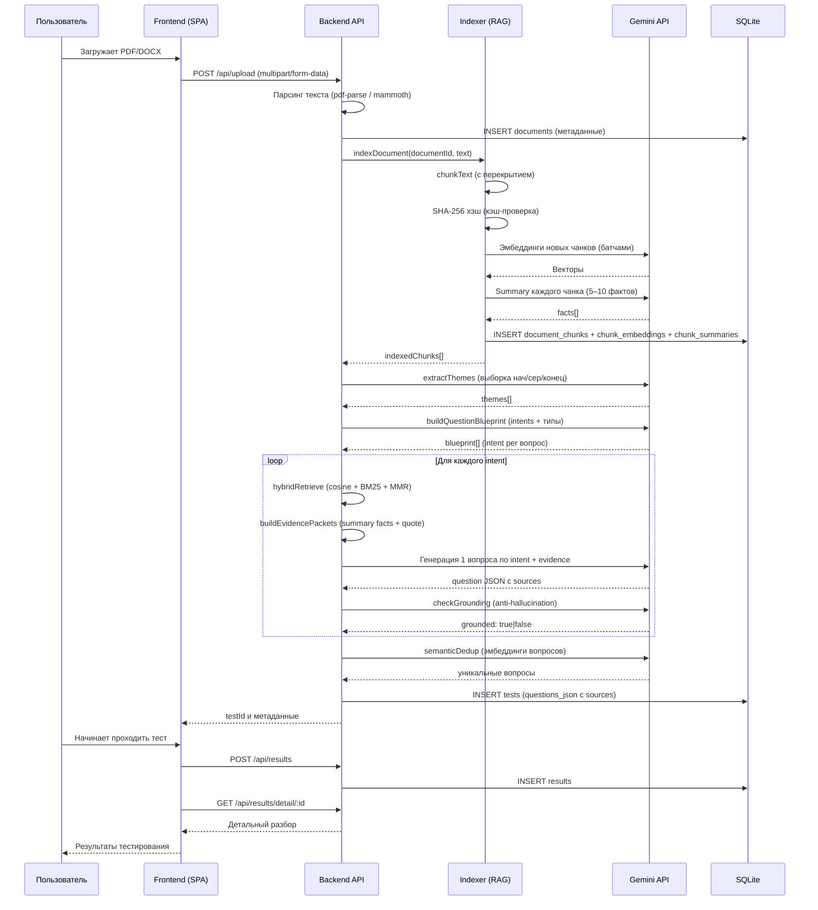

# Архитектура проекта: AI Test Generator

## Назначение приложения
AI Test Generator — это веб-приложение для автоматической генерации тестовых заданий из загруженных документов (PDF, DOCX) с использованием больших языковых моделей (LLM). Оно служит инструментом для преподавателей, HR-специалистов и студентов, позволяя за считанные минуты получить структурированный тест по материалам лекций, регламентов или статей.

## Основные компоненты

Приложение разделено на два основных модуля:

1.  **Frontend (SPA на Vanilla JS)**
    *   **Технологии**: HTML5, CSS3, Vanilla JavaScript (без сборщиков типа Webpack/Vite).
    *   **Ответственность**: Отправка файлов на сервер, отображение состояния загрузки (прогресс-бар), рендеринг списка тестов, проведение квиза (пошаговый показ вопросов) и отображение детальных результатов.
    *   **Взаимодействие**: Обращается к Backend API (`/api/*`) с помощью встроенного `fetch`.

2.  **Backend (Node.js + Express)**
    *   **Технологии**: Node.js, Express, `better-sqlite3`, `@google/genai`, `pdf-parse`, `mammoth`, `pdf2pic`, `tesseract.js` (для OCR отсканированных PDF).
    *   **Ответственность**:
        *   Прием файлов (`multer`).
        *   Извлечение текста из PDF/DOCX (`parser.js`).
        *   Разбиение текста на чанки с учетом токенов и перекрытием (`chunker.js`).
        *   **RAG Индексация**: чанки → SHA-256 хэш (кэш) → батчевые эмбеддинги (`text-embedding-004`) → LLM-summary (5–10 ключевых фактов на чанк) → сохранение в SQLite (`indexer.js`).
        *   **RAG Retrieval**: гибридный скоринг (векторный cosine + лексический BM25-lite) + MMR (Maximal Marginal Relevance) для разнообразия → формирование evidence packets из summaries вместо сырого текста (`rag.js`).
        *   **Генерация**: blueprint intents (темы → подтемы) → retrieval per intent → генерация 1 вопроса с `sources: [{chunk_id, quote}]` → проверка groundedness → семантическая дедупликация по эмбеддингам (`generator.js`).
        *   Хранение истории документов, тестов и результатов прохождений в SQLite (`database.js`).
        *   Раздача статики Frontend-части.

## RAG-архитектура (полноценный пайплайн)

Система реализует **полноценный RAG** вместо наивного "весь текст в промпт":

1. **Индексация (один раз на документ)**: чанки → SHA-256 кэш → батчевые эмбеддинги → LLM-summary (5–10 фактов) → SQLite (`document_chunks`, `chunk_embeddings`, `chunk_summaries`). При повторной генерации теста индекс переиспользуется, эмбеддинги не пересчитываются.

2. **Blueprint вопросов**: LLM анализирует репрезентативную выборку из начала/середины/конца документа → выделяет 5–8 тем → для каждой темы создаёт 2–6 question intents (конкретных подтем с указанием типа вопроса). Итого: 20–30 intents, ровно столько сколько нужно вопросов.

3. **Retrieval per intent**: для каждого intent — гибридный поиск: `score = 0.75 * cosine + 0.25 * BM25-lite`. Из топ-N кандидатов MMR (λ=0.65) отбирает K разнообразных чанков.

4. **Contextual compression**: вместо сырого текста чанка в LLM уходят evidence packets — `[{chunk_id, facts: [...], quote: "..."}]`. Экономия токенов в 3–10 раз.

5. **Генерация с источниками**: LLM генерирует 1 вопрос по intent + evidence, обязательно возвращает `sources: [{chunk_id, quote}]`.

6. **Anti-hallucination (groundedness check)**: второй дешёвый вызов (temperature=0) проверяет, подтверждается ли correct_answer evidence. Не прошедшие проверку вопросы исключаются.

7. **Семантическая дедупликация**: эмбеддинги вопросов + cosine > 0.88 → удаление смысловых дублей (лучше, чем только Levenshtein).

## Поток данных (Data Flow)

## Текущие ограничения системы

*   **Типы файлов**: Только `.pdf` и `.docx`.
*   **Ограничение размера**: Максимальный размер загружаемого файла — 10 МБ.
*   **Ограничение по объему**: Максимум 30 страниц (настраивается в `config.js`).
*   **OCR для отсканированных PDF**: опционален. Если в PDF нет текстового слоя и включён `ENABLE_PDF_OCR`, сервер конвертирует страницы в изображения (через pdf2pic) и распознаёт текст через Tesseract.js. Для этого на машине должны быть установлены **GraphicsMagick** и **Ghostscript**. Действует лимит страниц для OCR (`MAX_OCR_PAGES`, по умолчанию 10).
*   **Rate Limiting**:
    *   Загрузка файлов: 10 запросов в 15 минут.
    *   Остальное API: 100 запросов в 15 минут.
*   **Генерация (LLM)**: В случае неудачи LLM-запроса реализован механизм повторных попыток (retries) с экспоненциальной задержкой (по умолчанию 3 попытки). Если все попытки провалены, чанк пропускается.

## Конфигурация RAG (config.js)

| Параметр | Значение по умолчанию | Описание |
|---|---|---|
| `EMBEDDING_MODEL` | `text-embedding-004` | Модель эмбеддингов Gemini |
| `TARGET_QUESTIONS_MIN` | `20` | Минимум вопросов в тесте |
| `TARGET_QUESTIONS_MAX` | `30` | Максимум вопросов в тесте |
| `RAG_TOP_K` | `3` | Финальное кол-во чанков на intent (после MMR) |
| `RETRIEVAL_TOP_N` | `12` | Кандидаты для MMR (перед отсевом) |
| `RAG_THRESHOLD` | `0.0` | Минимальный cosine (0 = без фильтра) |
| `MMR_LAMBDA` | `0.65` | 0 = max diversity, 1 = max relevance |
| `EMBED_BATCH_SIZE` | `5` | Чанков в одном батче эмбеддингов |
| `EMBED_CONCURRENCY` | `2` | Параллельных запросов эмбеддингов |
| `ENABLE_GROUNDING` | `true` | Проверка anti-hallucination |
| `DEDUP_THRESHOLD` | `0.88` | Порог семантического дубля |

Все параметры можно переопределить через `.env`.

## Модель данных (Схема БД)

Используется SQLite (`data.db`).

*   **`documents`**:
    *   `id`, `filename`, `original_name`, `page_count`, `text_length`, `created_at`
*   **`tests`**:
    *   `id`, `document_id` (FK), `title`, `questions_json` (массив вопросов с полем `sources`), `total_questions`, `created_at`
*   **`results`**:
    *   `id`, `test_id` (FK), `user_name`, `answers_json` (подробный разбор), `score`, `max_score`, `percentage`, `completed_at`
*   **`document_chunks`** (RAG индекс):
    *   `id`, `document_id` (FK), `chunk_index`, `text`, `token_count`, `content_hash` (SHA-256, кэш), `created_at`
*   **`chunk_embeddings`** (RAG индекс):
    *   `id`, `chunk_id` (FK), `embedding_model`, `embedding` (JSON float[]), `dims`, `created_at`
*   **`chunk_summaries`** (контекстная компрессия):
    *   `id`, `chunk_id` (FK), `summary_text` (JSON string[], 5–10 фактов), `created_at`

## Архитектурные риски и текущие проблемы (решаются в рамках рефакторинга)

1.  **Рассинхрон LLM-провайдеров**: До рефакторинга конфигурация (`.env` и `config.js`) была настроена на `GEMINI_API_KEY`, тогда как `generator.js` использовал `openai` SDK. Это вызывало неработоспособность основного флоу. В рамках текущего плана система переводится на `@google/genai` как на единственный источник правды.
2.  **Закоммиченный `node_modules`**: В репозиторий попала папка зависимостей бэкенда, что утяжеляет вес проекта и может приводить к конфликтам (напр. бинарник `better-sqlite3` для Windows не подойдет для Linux-сервера). Решается правильным `.gitignore` и переустановкой пакетов.
3.  **Подсчет токенов**: Сейчас подсчет токенов (`chunker.js`) идет через `js-tiktoken` (алгоритм OpenAI), а модель используется от Google (Gemini). Это допустимое *приближение*, но не 100% точное. В будущем, для строгого контроля контекста, рекомендуется использовать нативные счетчики токенов Gemini, если они станут доступны локально, или оставлять хороший запас (буфер).