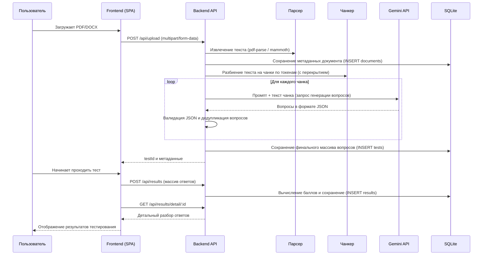

# Архитектура проекта: AI Test Generator

## Назначение приложения
AI Test Generator — это веб-приложение для автоматической генерации тестовых заданий из загруженных документов (PDF, DOCX) с использованием больших языковых моделей (LLM). Оно служит инструментом для преподавателей, HR-специалистов и студентов, позволяя за считанные минуты получить структурированный тест по материалам лекций, регламентов или статей.

## Основные компоненты

Приложение разделено на два основных модуля:

1.  **Frontend (SPA на Vanilla JS)**
    *   **Технологии**: HTML5, CSS3, Vanilla JavaScript (без сборщиков типа Webpack/Vite).
    *   **Ответственность**: Отправка файлов на сервер, отображение состояния загрузки (прогресс-бар), рендеринг списка тестов, проведение квиза (пошаговый показ вопросов) и отображение детальных результатов.
    *   **Взаимодействие**: Обращается к Backend API (`/api/*`) с помощью встроенного `fetch`.

2.  **Backend (Node.js + Express)**
    *   **Технологии**: Node.js, Express, `better-sqlite3`, `@google/genai`, `pdf-parse`, `mammoth`, `pdf2pic`, `tesseract.js` (для OCR отсканированных PDF).
    *   **Ответственность**:
        *   Прием файлов (`multer`).
        *   Извлечение текста из PDF/DOCX (модули `parser.js`).
        *   Разбиение текста на фрагменты (чанки) с учетом ограничений LLM на количество токенов (`chunker.js`).
        *   Генерация вопросов с использованием Google Gemini (`generator.js`).
        *   Хранение истории документов, тестов и результатов прохождений в легковесной базе данных SQLite (`database.js`).
        *   Раздача статики Frontend-части.

## Поток данных (Data Flow)

## Текущие ограничения системы

*   **Типы файлов**: Только `.pdf` и `.docx`.
*   **Ограничение размера**: Максимальный размер загружаемого файла — 10 МБ.
*   **Ограничение по объему**: Максимум 30 страниц (настраивается в `config.js`).
*   **OCR для отсканированных PDF**: опционален. Если в PDF нет текстового слоя и включён `ENABLE_PDF_OCR`, сервер конвертирует страницы в изображения (через pdf2pic) и распознаёт текст через Tesseract.js. Для этого на машине должны быть установлены **GraphicsMagick** и **Ghostscript**. Действует лимит страниц для OCR (`MAX_OCR_PAGES`, по умолчанию 10).
*   **Rate Limiting**:
    *   Загрузка файлов: 10 запросов в 15 минут.
    *   Остальное API: 100 запросов в 15 минут.
*   **Генерация (LLM)**: В случае неудачи LLM-запроса реализован механизм повторных попыток (retries) с экспоненциальной задержкой (по умолчанию 3 попытки). Если все попытки провалены, чанк пропускается.

## Модель данных (Схема БД)

Используется SQLite (`data.db`).

*   **`documents`**:
    *   `id`, `filename`, `original_name`, `page_count`, `text_length`, `created_at`
*   **`tests`**:
    *   `id`, `document_id` (FK), `title`, `questions_json` (строка), `total_questions`, `created_at`
*   **`results`**:
    *   `id`, `test_id` (FK), `user_name`, `answers_json` (подробный разбор), `score`, `max_score`, `percentage`, `completed_at`

## Архитектурные риски и текущие проблемы (решаются в рамках рефакторинга)

1.  **Рассинхрон LLM-провайдеров**: До рефакторинга конфигурация (`.env` и `config.js`) была настроена на `GEMINI_API_KEY`, тогда как `generator.js` использовал `openai` SDK. Это вызывало неработоспособность основного флоу. В рамках текущего плана система переводится на `@google/genai` как на единственный источник правды.
2.  **Закоммиченный `node_modules`**: В репозиторий попала папка зависимостей бэкенда, что утяжеляет вес проекта и может приводить к конфликтам (напр. бинарник `better-sqlite3` для Windows не подойдет для Linux-сервера). Решается правильным `.gitignore` и переустановкой пакетов.
3.  **Подсчет токенов**: Сейчас подсчет токенов (`chunker.js`) идет через `js-tiktoken` (алгоритм OpenAI), а модель используется от Google (Gemini). Это допустимое *приближение*, но не 100% точное. В будущем, для строгого контроля контекста, рекомендуется использовать нативные счетчики токенов Gemini, если они станут доступны локально, или оставлять хороший запас (буфер).