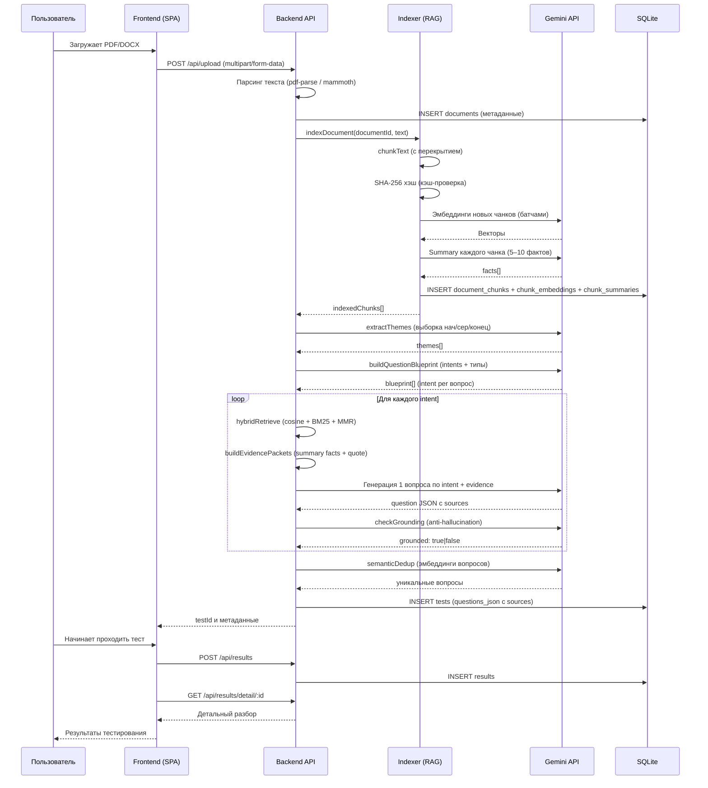

# Архитектура проекта: AI Test Generator

## Назначение приложения
AI Test Generator — это веб-приложение для автоматической генерации тестовых заданий из загруженных документов (PDF, DOCX) с использованием больших языковых моделей (LLM). Оно служит инструментом для преподавателей, HR-специалистов и студентов, позволяя за считанные минуты получить структурированный тест по материалам лекций, регламентов или статей.

## Основные компоненты

Приложение разделено на два основных модуля:

1.  **Frontend (Vue 3 SPA)**
    *   **Технологии**: Vue 3, Vite, Tailwind CSS, shadcn-vue.
    *   **Ответственность**: Отправка файлов на сервер, отображение состояния загрузки, рендеринг списка тестов, проведение квиза и отображение детальных результатов.
    *   **Взаимодействие**: Обращается к Backend API (`/api/*`) с помощью `fetch` (инкапсулировано в `src/lib/api.ts`).

2.  **Backend (Node.js + Express)**
    *   **Технологии**: Node.js, Express, `better-sqlite3`, `@google/genai`, `pdf-parse`, `mammoth`, `pdf2pic`, `tesseract.js` (для OCR отсканированных PDF).
    *   **Ответственность**:
        *   Прием файлов (`multer`).
        *   Извлечение текста из PDF/DOCX (`parser.js`).
        *   Разбиение текста на чанки с учетом токенов и перекрытием (`chunker.js`).
        *   **RAG Индексация**: чанки → SHA-256 хэш (кэш) → батчевые эмбеддинги (`text-embedding-004`) → LLM-summary (5–10 ключевых фактов на чанк) → сохранение в SQLite (`indexer.js`).
        *   **RAG Retrieval**: гибридный скоринг (векторный cosine + лексический BM25-lite) + MMR (Maximal Marginal Relevance) для разнообразия → формирование evidence packets из summaries вместо сырого текста (`rag.js`).
        *   **Генерация**: blueprint intents (темы → подтемы) → retrieval per intent → генерация 1 вопроса с `sources: [{chunk_id, quote}]` → проверка groundedness → семантическая дедупликация по эмбеддингам (`generator.js`).
        *   Хранение истории документов, тестов и результатов прохождений в SQLite (`database.js`).
        *   Раздача статики Frontend-части.

## RAG-архитектура (полноценный пайплайн)

Система реализует **полноценный RAG** вместо наивного "весь текст в промпт":

1. **Индексация (один раз на документ)**: чанки → SHA-256 кэш → батчевые эмбеддинги → LLM-summary (5–10 фактов) → SQLite (`document_chunks`, `chunk_embeddings`, `chunk_summaries`). При повторной генерации теста индекс переиспользуется, эмбеддинги не пересчитываются.

2. **Blueprint вопросов**: LLM анализирует репрезентативную выборку из начала/середины/конца документа → выделяет адаптивное количество тем (от 1 до 14, в зависимости от объёма фактов) → для каждой темы создаёт question intents (конкретные подтемы с указанием типа вопроса). Целевое число вопросов вычисляется **интеллектуально по информационной ёмкости**: учитываются уникальные (без перекрытия) токены, количество извлечённых атомарных фактов и качество парсинга текста (extraction quality). Итоговая цель ограничивается `TARGET_QUESTIONS_MIN`–`TARGET_QUESTIONS_MAX`, причём нижняя граница (MIN) адаптивно снижается для коротких или бедных на факты документов, чтобы избежать генерации «пустых» или повторяющихся вопросов. Blueprint возвращает ровно вычисленное количество intents.

3. **Retrieval per intent**: для каждого intent — гибридный поиск: `score = 0.75 * cosine + 0.25 * BM25-lite`. Из топ-N кандидатов MMR (λ=0.65) отбирает K разнообразных чанков.

4. **Contextual compression**: evidence packets содержат слои «опоры из текста», при наличии — «факты модели», плюс усечённый сырой текст чанка (`evidenceBuilder.js`). Раньше опирались в основном на один слой summary.

5. **Генерация с источниками**: LLM генерирует 1 вопрос по intent + evidence, обязательно возвращает `sources: [{chunk_id, quote}]`.

6. **Anti-hallucination (groundedness check)**: второй дешёвый вызов (temperature=0) проверяет, подтверждается ли correct_answer evidence. Не прошедшие проверку вопросы исключаются.

7. **Семантическая дедупликация**: эмбеддинги вопросов + cosine > 0.88 → удаление смысловых дублей (лучше, чем только Levenshtein).

## Поток данных (Data Flow)

```mermaid
sequenceDiagram
  participant User as Пользователь
  participant FE as Frontend (SPA)
  participant BE as Backend API
  participant Indexer as Indexer (RAG)
  participant LLM as Gemini API
  participant DB as SQLite

  User->>FE: Загружает PDF/DOCX
  FE->>BE: POST /api/upload (multipart/form-data)
  BE->>BE: Парсинг текста (pdf-parse / mammoth)
  BE->>DB: INSERT documents (метаданные)
  BE->>Indexer: indexDocument(documentId, text)
  Indexer->>Indexer: chunkText (с перекрытием)
  Indexer->>Indexer: SHA-256 хэш (кэш-проверка)
  Indexer->>LLM: Эмбеддинги новых чанков (батчами)
  LLM-->>Indexer: Векторы
  Indexer->>LLM: Summary каждого чанка (5–10 фактов)
  LLM-->>Indexer: facts[]
  Indexer->>DB: INSERT document_chunks + chunk_embeddings + chunk_summaries
  Indexer-->>BE: indexedChunks[]
  BE->>LLM: extractThemes (выборка нач/сер/конец)
  LLM-->>BE: themes[]
  BE->>LLM: buildQuestionBlueprint (intents + типы)
  LLM-->>BE: blueprint[] (intent per вопрос)
  loop Для каждого intent
    BE->>BE: hybridRetrieve (cosine + BM25 + MMR)
    BE->>BE: buildEvidencePackets (summary facts + quote)
    BE->>LLM: Генерация 1 вопроса по intent + evidence
    LLM-->>BE: question JSON с sources
    BE->>LLM: checkGrounding (anti-hallucination)
    LLM-->>BE: grounded: true|false
  end
  BE->>LLM: semanticDedup (эмбеддинги вопросов)
  LLM-->>BE: уникальные вопросы
  BE->>DB: INSERT tests (questions_json с sources)
  BE-->>FE: testId и метаданные
  User->>FE: Начинает проходить тест
  FE->>BE: POST /api/results
  BE->>DB: INSERT results
  FE->>BE: GET /api/results/detail/:id
  BE-->>FE: Детальный разбор
  FE-->>User: Результаты тестирования
```

## Текущие ограничения системы

*   **Типы файлов**: Только `.pdf` и `.docx`.
*   **Ограничение размера**: Максимальный размер загружаемого файла — 10 МБ.
*   **Ограничение по объему**: Максимум 30 страниц (настраивается в `config.js`).
*   **OCR для отсканированных PDF**: опционален. Если в PDF нет текстового слоя и включён `ENABLE_PDF_OCR`, сервер конвертирует страницы в изображения (через pdf2pic) и распознаёт текст через Tesseract.js. Для этого на машине должны быть установлены **GraphicsMagick** и **Ghostscript**. Действует лимит страниц для OCR (`MAX_OCR_PAGES`, по умолчанию 10).
*   **Rate Limiting**:
    *   Загрузка файлов: 10 запросов в 15 минут.
    *   Остальное API: 100 запросов в 15 минут.
*   **Генерация (LLM)**: В случае неудачи LLM-запроса реализован механизм повторных попыток (retries) с экспоненциальной задержкой (по умолчанию 3 попытки). Если все попытки провалены, чанк пропускается.

## Конфигурация RAG (config.js)

| Параметр | Значение по умолчанию | Описание |
|---|---|---|
| `EMBEDDING_MODEL` | `text-embedding-004` | Модель эмбеддингов Gemini |
| `TARGET_QUESTIONS_MIN` | `20` | Минимум вопросов в тесте (нижняя граница при адаптивном расчёте) |
| `TARGET_QUESTIONS_MAX` | `30` | Максимум вопросов в тесте (верхняя граница при адаптивном расчёте) |
| `QUESTIONS_PER_CHUNK` | `4` | Множитель для расчёта цели по чанкам: цель = чанки × это значение (затем clamp в MIN–MAX) |
| `CHAR_LENGTH_PER_QUESTION` | `2000` | При расчёте по длине текста (если нет чанков): цель = длина_текста / это значение |
| `RAG_TOP_K` | `3` | Финальное кол-во чанков на intent (после MMR) |
| `RETRIEVAL_TOP_N` | `12` | Кандидаты для MMR (перед отсевом) |
| `RAG_THRESHOLD` | `0.0` | Минимальный cosine (0 = без фильтра) |
| `MMR_LAMBDA` | `0.65` | 0 = max diversity, 1 = max relevance |
| `EMBED_BATCH_SIZE` | `5` | Чанков в одном батче эмбеддингов |
| `EMBED_CONCURRENCY` | `2` | Параллельных запросов эмбеддингов |
| `ENABLE_GROUNDING` | `true` | Проверка anti-hallucination |
| `DEDUP_THRESHOLD` | `0.88` | Порог семантического дубля |

Все параметры можно переопределить через `.env`.

## База данных: PostgreSQL

Проект использует **PostgreSQL** как основную СУБД. Подключение через connection pool (`pg`, `backend/db/pgPool.js`). Схема управляется через SQL-миграции (`backend/db/migrations/*.sql`) с автоматическим применением при старте сервера.

Векторы (эмбеддинги) хранятся как JSONB в `chunk_embeddings`; поиск по косинусному сходству выполняется **в памяти** только по чанкам **одного документа** (RAG scope = один документ). При необходимости можно подключить `pgvector` для in-DB поиска.

### Файловое хранилище: MinIO / local

PDF-файлы хранятся в object storage (MinIO) или на локальном диске (fallback). Конфигурируется через `STORAGE_BACKEND` (`minio` / `local`). В БД сохраняются только метаданные: `storage_bucket`, `storage_key`, `checksum_sha256`, `size_bytes`. Повторная загрузка файла с тем же checksum переиспользует существующий объект.

---

## Модель данных (Схема БД)

Используется PostgreSQL. Миграции: `backend/db/migrations/`.

### Core таблицы
*   **`documents`**: метаданные документа + привязка к object storage (`storage_bucket`, `storage_key`, `checksum_sha256`, `size_bytes`, `mime_type`, `status`). JSONB: `parse_diagnostics`.
*   **`chunks`** (бывш. `document_chunks`): `document_id` FK, `chunk_index`, `text`, `token_count`, `content_hash` (SHA-256, кэш), `page`, `section`, `heading`.
*   **`chunk_embeddings`**: `chunk_id` FK, `embedding_model`, `embedding` (JSONB float[]), `dims`. UNIQUE(`chunk_id`, `embedding_model`).
*   **`chunk_summaries`**: `chunk_id` FK, `summary_text` (JSONB string[], основные факты — LLM или extractive), `extractive_facts` (JSONB string[], эвристические опоры из текста, дублируются/дополняют primary), `summary_source`, `summary_status`. UNIQUE(`chunk_id`).
*   **`tests`**: `document_id` FK, `title`, `questions_json` (JSONB), `total_questions`, `generation_metrics` (JSONB), `generation_run_id` FK.
*   **`results`**: `test_id` FK, `user_name`, `answers_json` (JSONB), `score`, `max_score`, `percentage`.
*   **`app_settings`**: key-value настройки (API ключ и т.д.).
*   **`gemini_usage`**: дневной учёт запросов к LLM.

### Pipeline таблицы (observability)
*   **`generation_runs`**: каждый запуск генерации. `document_id`, `status`, `model`, `target_min/max/count`, `budget_metrics` (JSONB), `final_metrics` (JSONB), `duration_ms`.
*   **`intents`**: план вопросов. `run_id`, `theme`, `section`, `intent_text`, `difficulty`, `status`, `skip_reason`, `evidence_score`.
*   **`questions`**: нормализованные вопросы. `run_id`, `question`, `options` (JSONB), `correct_index`, `difficulty`, `explanation`, `hint`, `grounded`.
*   **`question_sources`**: связь вопрос↔чанк. `question_id`, `chunk_id`, `quote`.
*   **`pipeline_run_events`**: лог событий pipeline. `run_id`, `phase`, `event`, `level`, `reason_code`, `metrics` (JSONB), `metadata` (JSONB).
*   **`document_sections`**: секции документа (опционально).

### AI Admin: Custom Mode Profiles
Добавлен отдельный слой управления режимами ИИ (не alias `manual override`):

* **`custom_mode_profiles`**: карточка режима (`code`, `name`, `parent_mode`, `status`, global flags `allow_premium/allow_preview/stable_only/emergency_fallback`, budget limits, `config_version`).
* **`custom_mode_stage_assignments`**: назначение модели и fallback по `mission/stage/role` (`primary_model_id`, `fallback_model_ids[]`, `override_strength`, локальные allow flags).
* **`custom_mode_profile_versions`**: immutable snapshot конфигурации по версии.

Интеграция с observability:
* в **`generation_runs`** добавлены `mode_profile_id`, `mode_profile_version`, `requested_mode_code`;
* в **`ai_routing_decisions`** добавлены `mode_profile_id`, `mode_profile_version`, `configured_source`, `effective_source`.

Это позволяет показывать в UI три уровня:
`configured model` -> `effective model` -> `actual executed`.

## Архитектурные риски и текущие проблемы (решаются в рамках рефакторинга)

1.  **Рассинхрон LLM-провайдеров**: До рефакторинга конфигурация (`.env` и `config.js`) была настроена на `GEMINI_API_KEY`, тогда как `generator.js` использовал `openai` SDK. Это вызывало неработоспособность основного флоу. В рамках текущего плана система переводится на `@google/genai` как на единственный источник правды.
2.  **Закоммиченный `node_modules`**: В репозиторий попала папка зависимостей бэкенда, что утяжеляет вес проекта и может приводить к конфликтам (напр. бинарник `better-sqlite3` для Windows не подойдет для Linux-сервера). Решается правильным `.gitignore` и переустановкой пакетов.
3.  **Подсчет токенов**: Сейчас подсчет токенов (`chunker.js`) идет через `js-tiktoken` (алгоритм OpenAI), а модель используется от Google (Gemini). Это допустимое *приближение*, но не 100% точное. В будущем, для строгого контроля контекста, рекомендуется использовать нативные счетчики токенов Gemini, если они станут доступны локально, или оставлять хороший запас (буфер).